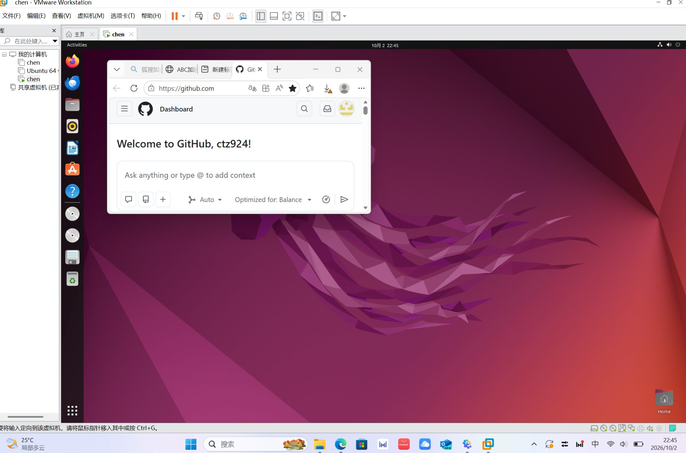

# environment —— 配置环境

记录开发环境的配置过程与要点。

## 已完成

- Windows 宿主机安装 VMware Workstation
- 创建 Ubuntu 64 位虚拟机（已配置共享文件夹）
- Windows 安装 Visual Studio 2022，编写并运行第一个 C 程序
- 在 Ubuntu 中打开浏览器，登录 GitHub 账号（ctz924）

## 配置截图

*图：VMware Workstation 中运行 Ubuntu 虚拟机，浏览器已登录 GitHub*

## 待补充

- Ubuntu 中更换软件源、安装 GCC / ROS 的步骤
- 环境变量与常用工具配置
